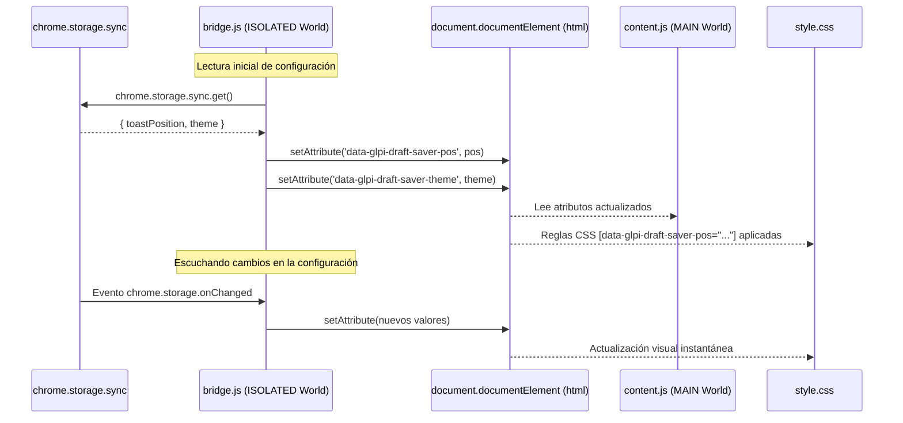

# Guía de Documentación para AIs y Agentes Autónomos (`docs/README_AI.md`)

Esta documentación está optimizada para LLMs, copilotos y agentes autónomos. Explica la arquitectura, los flujos clave y las herramientas de análisis semántico integradas en este repositorio.

---

## 1. Mapa de Archivos y Responsabilidades

- [manifest.json](file:///c:/Users/japeraba/dev/glpi-task-draft-saver-extension/extension/manifest.json): Manifiesto de Extensión V3. Define los permisos (`storage`, `alarms`), el service worker de fondo, y los dos content scripts con sus respectivos contextos de ejecución.
- [background.js](file:///c:/Users/japeraba/dev/glpi-task-draft-saver-extension/extension/background.js): Service worker de fondo. Gestiona una alarma que se ejecuta cada 2 días para comprobar si la versión física de `manifest.json` en disco ha cambiado (útil para extensiones desplegadas sin empaquetar en carpetas de red compartidas) y fuerza el recargado de la extensión si es necesario.
- [bridge.js](file:///c:/Users/japeraba/dev/glpi-task-draft-saver-extension/extension/bridge.js): Script de contenido que se ejecuta en el mundo `ISOLATED`. Actúa como puente leyendo la configuración de `chrome.storage.sync` (tema y posición de notificaciones) y escribiéndola como atributos de datos en el elemento `<html>` del DOM.
- [content.js](file:///c:/Users/japeraba/dev/glpi-task-draft-saver-extension/extension/content.js): Script de contenido principal que se ejecuta en el mundo `MAIN`. Detecta la carga de TinyMCE en los formularios ITIL de GLPI, añade escuchas de eventos, guarda los borradores en `localStorage` y renderiza la interfaz visual (toasts de restauración y guardado).
- [style.css](file:///c:/Users/japeraba/dev/glpi-task-draft-saver-extension/extension/style.css): Contiene los estilos visuales de los toasts con diseño moderno, animaciones y glassmorphism. Soporta cambio dinámico de tema y posición leyendo los atributos de la etiqueta `<html>`.
- [popup.html](file:///c:/Users/japeraba/dev/glpi-task-draft-saver-extension/extension/popup.html) & [popup.js](file:///c:/Users/japeraba/dev/glpi-task-draft-saver-extension/extension/popup.js): Interfaz de usuario de configuración rápida de la extensión para habilitar el modo oscuro y cambiar la posición de los avisos visuales en pantalla.

---

## 2. Flujo Arquitectónico y Sincronización



---

## 3. Integración con TinyMCE en GLPI (Detalles Críticos)

Los formularios de GLPI se renderizan dinámicamente y las instancias del editor de TinyMCE no están disponibles de forma inmediata al dispararse `DOMContentLoaded`. Por tanto, se aplican los siguientes patrones:

1. **Detección Dinámica y Reactiva**:
   Se ejecuta un escaneo inicial de los editores TinyMCE activos en la página (`window.tinymce.editors`). Para evitar el consumo constante de recursos, se añade un escuchador global a clics en la página que inicia una ventana de polling de 30 segundos cada vez que el usuario interactúa (por ejemplo, al pulsar el botón de crear nueva tarea o de editar una existente).

2. **Identificación de Contexto y Claves Dinámicas**:
   Cada editor es clasificado analizando su formulario padre mediante la función `getEditorConfig(textarea)`:
   - Tipo de borrador: Se define mediante el campo `<input name="itemtype">` (`TicketTask` -> `task`, `ITILFollowup` -> `followup`, etc.).
   - Modo de edición: Se define mediante el campo `<input name="id">`. Si el valor es mayor a 0 y distinto al ID del ticket de la página, se identifica como edición de un elemento existente.
   - Las claves de persistencia en `localStorage` se mapean de la siguiente manera:
     - Nuevo elemento: `glpi_draft_<tipo>_ticket_<ticketId>`
     - Edición de elemento existente: `glpi_draft_<tipo>_ticket_<ticketId>_edit_<id_elemento>`

3. **Acciones de Restauración Segura**:
   Cuando el usuario decide restaurar un borrador:
   - **Copia de seguridad instantánea**: Copia el texto HTML limpio al portapapeles (`navigator.clipboard.writeText`).
   - **Forzar Carga del Editor**: Si es un nuevo elemento, hace clic en el botón de visibilidad correspondiente. Si es un borrador de edición, busca el botón "Editar" específico de ese ID en la línea de tiempo mediante `findEditButton(type, itemId)` y simula un clic para forzar su renderizado vía AJAX.
   - **Retraso de Escritura**: La inyección del contenido (`setContent`) se retrasa **300ms** después de la visibilidad para permitir la correcta inicialización de TinyMCE. Si no se puede inyectar automáticamente después de 8 intentos, se muestra un toast informando de que el borrador fue copiado al portapapeles.
   - **Limpieza**: El evento de submit del formulario limpia específicamente la clave de `localStorage` del editor enviado.

---

## 4. Uso del Grafo de Conocimiento (`codebase-memory-mcp`)

Este proyecto incluye el soporte de un grafo local indexado mediante `codebase-memory-mcp`. Para optimizar tus interacciones:

- **Indexar cambios**: Si has realizado modificaciones significativas en el código, puedes actualizar el grafo ejecutando el comando:
  ```powershell
  codebase-memory-mcp cli index_repository '{"repo_path": "c:/Users/japeraba/dev/glpi-task-draft-saver-extension"}'
  ```
- **Consultar la Arquitectura**: Para obtener un mapa semántico global de las dependencias, funciones y llamadas del código:
  - Invoca la herramienta `get_architecture`.
- **Rastrear Flujo de Llamadas**: Si modificas funciones críticas como `saveDraft` o `handleRestoreAction`, puedes analizar qué funciones se ven afectadas utilizando la herramienta `trace_path`:
  - Entrada: `{"function_name": "saveDraft", "direction": "inbound"}`
- **Visualización en 3D del Grafo**: Puedes explorar la arquitectura y dependencias visualmente abriendo un navegador en `http://localhost:9749` (siempre y cuando el servicio de visualización esté en ejecución en el puerto por defecto). Para habilitarlo o deshabilitarlo de forma persistente en la configuración del binario:
  ```powershell
  codebase-memory-mcp --ui=true
  ```
